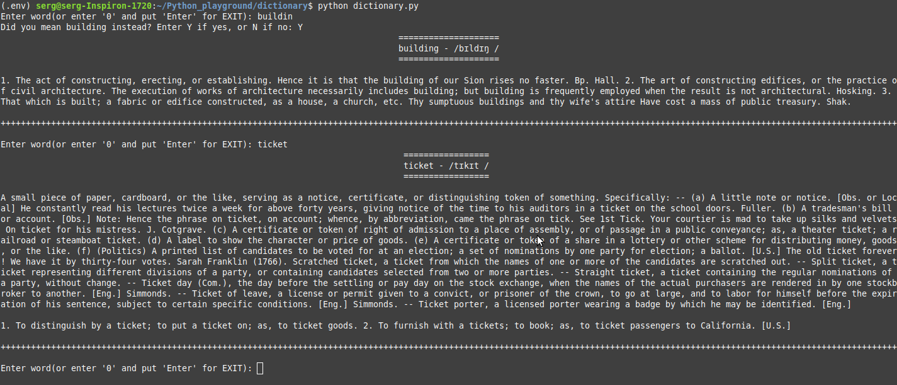

# dictionary

**About:** The offline english dictionary and the dictionary of english phrasal verbs for linux terminal

**Description:** The advantage of this program is that there is no need for an Internet connection and graphical environment. For the getting an English transcription the program uses the package <a href="https://github.com/bootphon/phonemizer">"phonemizer"</a> with her backend "espeak".

<b>Installation for Linux*:</b>

1. Clone the repository (or download the zip file and extract it):

    $ `git clone git@github.com:maninserg/dictionary.git`

2. Go to the directory of the program:
   
    $ `cd <your name of directory with the program>`

3. Create of a virtual environment:

    $ `python3 -m venv .venv`

4. Activate the virtual environment:

    $ `source .venv/bin/activate`

5. Install necessary packages using pip according to the requirements.txt file from a directory with the program:

    (.venv) $ `pip install -r requirements.txt`
    
6. Install espeak for your linux system, for Debian linux systems use following command:

    $ sudo apt-get install espeak

<i>*The installation for MacOS or Windows can be other</i>

**Sreenshots:**

  

<b>The work of the dictionary in the linux terminal</b>

**License:** 

Webster's Unabridged English Dictionary text file is licensed by "The Gutenberg Project's licensing" and you can download it from <a href="http://www.gutenberg.org/"> the Gutenberg Project</a>.
I used the parsed dictionary in json format taken from the repository https://github.com/matthewreagan/WebstersEnglishDictionary (GPLv2 License).

The json format file "phrasal.verbs.build.json" with phrasal verbs of the English language was taken from the repository https://github.com/WithEnglishWeCan/generated-english-phrasal-verbs (MIT License).

The files with the text of this program "dictionary" is covered by GPLv3 License
